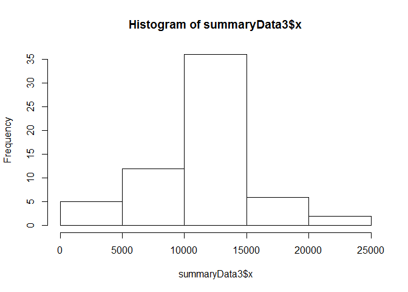

# Reproducible Research: Peer Assessment 1

## Loading and preprocessing the data

###Loading the Data 
The data has been extracted into the activity folder in the working directory


```r
rawData <- read.csv("activity/activity.csv", stringsAsFactors = FALSE)
```

###Preprocessing Data
Data has been changed to a date variable from string


```r
library(dplyr)
```

```
## 
## Attaching package: 'dplyr'
## 
## The following objects are masked from 'package:stats':
## 
##     filter, lag
## 
## The following objects are masked from 'package:base':
## 
##     intersect, setdiff, setequal, union
```

```r
library(lubridate)
activityData <- mutate(rawData, newDate = ymd(date))
```


## What is mean total number of steps taken per day?

###Total Number of steps taken per day


```r
activityData$date <- as.factor(activityData$date)
summaryData <- aggregate(activityData$steps,by=list(Category=activityData$date), FUN=sum, na.rm=TRUE)
```

The histogram of total number of steps taken per day


```r
hist(summaryData$x)
```

 

The mean of total steps taken per day is:

```r
mean(summaryData$x)
```

```
## [1] 9354.23
```

The median of the total number of steps taken per day is 

```r
median(summaryData$x)
```

```
## [1] 10395
```

## What is the average daily activity pattern?

###Average number of steps taken for each 5 minute interval, averaged across all days.


```r
activityData$interval <- as.factor(activityData$interval)
summaryData2 <- aggregate(activityData$steps,by=list(Category=activityData$interval), FUN=mean, na.rm=TRUE)
```


###Time series plot of average number of steps taken for each time series interval

plot(summaryData2$Category, summaryData2$x, type="l")

###The five minute interval containing the maximum number of steps


```r
maxamt <- max(summaryData2$x)
maxobservation <- filter(summaryData2, x == maxamt)
```

The 5 minute interval containing the maximum number of steps is:


```r
maxobservation$Category
```

```
## [1] 835
## 288 Levels: 0 5 10 15 20 25 30 35 40 45 50 55 100 105 110 115 120 ... 2355
```

## Imputing missing values
The total number of missing values in the database are:


```r
sum(is.na(activityData$steps))
```

```
## [1] 2304
```


###Missing values

The missing values will be replaced by the average of all steps taken over all intervals on all days.  This figure is:


```r
repvalue <- round(mean(activityData$steps, na.rm = TRUE))
```

All NA values will be replaced by 37 and stored in new dataframe named fullActivityData


```r
fullActivityData <- activityData
fullActivityData$steps[is.na(fullActivityData$steps)] <- repvalue
```

###Historgram of total steps taken per day with missing data

The total steps taken per day is


```r
fullActivityData$date <- as.factor(fullActivityData$date)
summaryData3 <- aggregate(fullActivityData$steps,by=list(Category=fullActivityData$date), FUN=sum, na.rm=TRUE)
```

The histogram of total number of steps taken per day


```r
hist(summaryData3$x)
```

 

The mean of total steps taken per day is:

```r
mean(summaryData3$x)
```

```
## [1] 10751.74
```

The median of the total number of steps taken per day is 

```r
median(summaryData3$x)
```

```
## [1] 10656
```


The data with missing data filled is much more bell shaped that that without the missing data.  The data with the missing data is much more skewed.

## Are there differences in activity patterns between weekdays and weekends?

###Labelling each record as weekend or weekday

```r
fullActivityData2 <- mutate(fullActivityData, DayOfWeek = weekdays(as.Date(fullActivityData$date)))

fullActivityData2 <- mutate(fullActivityData2, WeekendWeekday = ifelse(DayOfWeek == "Saturday" | DayOfWeek == "Sunday", "Weekend","Weekday"))
```

###Summarsing data - average steps taken per interval grouped by weekend/weekday.

```r
fullActivityData2$interval <- as.factor(fullActivityData2$interval)
summaryData4 <- aggregate(fullActivityData2$steps ,by=list(Interval=fullActivityData2$interval, WeekEnd = fullActivityData2$WeekendWeekday), FUN=mean, na.rm=TRUE)
```

###Panel Plot


```r
library(ggplot2)
ggplot(summaryData4, aes(Interval, x, group=1)) + geom_line() + facet_grid(WeekEnd ~.)
```

 
