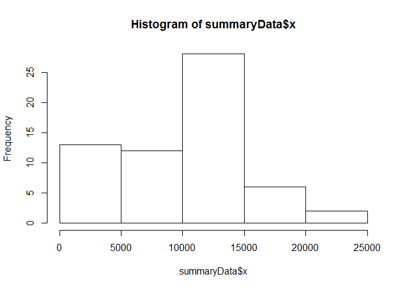

# Reproducible Research: Peer Assessment 1


## Loading and preprocessing the data

#Loading the Data 
The data has been extracted into the activity folder in the working directory


```r
rawData <- read.csv("activity/activity.csv", stringsAsFactors = FALSE)
```

#Preprocessing Data
Data has been changed to a date variable from string


```r
library(dplyr)
```

```
## 
## Attaching package: 'dplyr'
## 
## The following objects are masked from 'package:stats':
## 
##     filter, lag
## 
## The following objects are masked from 'package:base':
## 
##     intersect, setdiff, setequal, union
```

```r
library(lubridate)
activityData <- mutate(rawData, newDate = ymd(date))
```


## What is mean total number of steps taken per day?

#Total Number of steps taken per day


```r
activityData$date <- as.factor(activityData$date)
summaryData <- aggregate(activityData$steps,by=list(Category=activityData$date), FUN=sum, na.rm=TRUE)
```

The histogram of total number of steps taken per day


```r
hist(summaryData$x)
```

 

The mean of total steps taken per day is:

```r
mean(summaryData$x)
```

```
## [1] 9354.23
```

The median of the total number of steps taken per day is 

```r
median(summaryData$x)
```

```
## [1] 10395
```

## What is the average daily activity pattern?


## Imputing missing values


## Are there differences in activity patterns between weekdays and weekends?
